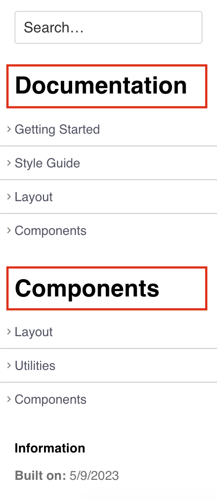
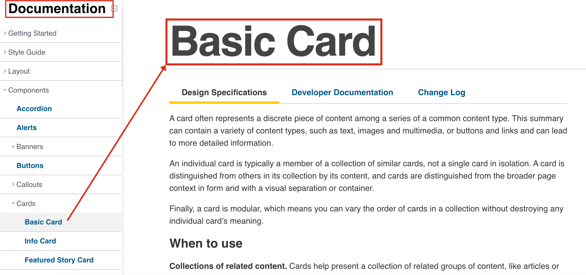
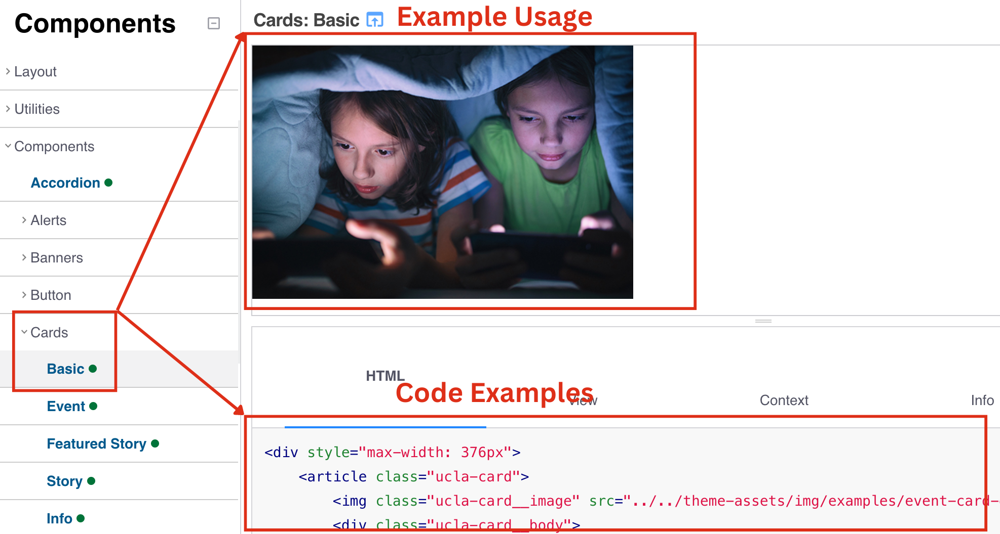

# How To Navigate the Website

The landing page will include a brief overview of the project.

[Installation](#) and [Contribution](#) notes are also included on the webpage.

## The website is then broken down into 2 parts:
1. Documentation
1. Components

These sections are broken down on the left-side menu.

## What Will I Find In Documentation?
- Designs for brand colors, typography, icons, and the library's grid
- Designs for our components
- Tips on what to do and what not to do when using components
- Notes on how to use components in code

## What is the Components Section Used For?
- Code examples with example component usage

