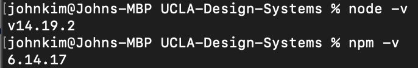

# Getting Started

---

## Table of Contents

* [Requirements](#requirements)
* [Instructions](#instructions)
* [Helpful npm commands](#helpful-npm-commands)

---

# Requirements

- Terminal (macOS) or Command Prompt (PC)
- [Node](https://nodejs.org/en/) - Tested with node 14.19.2
- [npm](https://www.npmjs.com/get-npm)

---

# Instructions

1. If you haven't already cloned the repository, do so by running the following in your command line:

  ```
  git clone https://github.com/ucla/UCLA-Design-Systems.git
  ```

2. Navigate to your local copy:

  ```
  cd UCLA-Design-Systems
  ```

3. Make sure `node` and `npm` have been installed successfully.

  `node -v`

  `npm -v`

  - If installed successfully, these commands should return a version number, similar to below:

    

4. Prepare the development environment:

  - `bash scripts/prepare.sh`

5. Go into the 'fractal' directory

  - `cd fractal`

6. Install Node Modules for Fractal

  - `npm install`

7. Run a Fractal Build

  - `npm run build`

8. Start Fractal

  - `npm run start`

  Your local environment should be running at [http://localhost:3000](http://localhost:3000).

---

# Helpful NPM Commands

| Task | Description |
|-|-|
| `npm run build` | Build Fractal framework, build expanded styling and scripts for both documentation and components library, and remove string filters (used for production versioning) |
| `npm run start` | Start Fractal development web server, watch for styling and script changes for both the documentation and components library, and run linters for both the documentation and components library |

---

# Conventional Commits

The Conventional Commits specification is a lightweight convention on top of commit messages. It provides an easy set of rules for creating an explicit commit history; which makes it easier to write automated tools on top of. This convention dovetails with SemVer, by describing the features, fixes, and breaking changes made in commit messages.

You can read more about it here: [conventional commits](https://www.conventionalcommits.org/en/v1.0.0/)

[conventional commits cheat sheet](https://cheatography.com/albelop/cheat-sheets/conventional-commits/)
